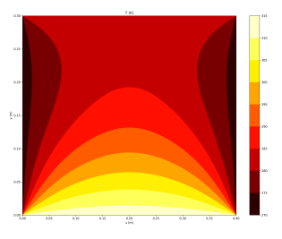
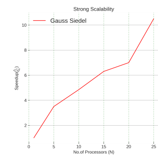

# Parallel 2D Heat Diffusion Solver using C and PETSc


This repository contains a parallel C implementation for solving the 2D steady-state heat diffusion equation on a structured grid. The solver is built using the **PETSc (Portable, Extensible Toolkit for Scientific Computation)** library and is designed for execution on HPC clusters.

## Overview

The primary goal of this project was to implement a parallel solver for a classic elliptic PDE and analyze its performance. The code uses the Finite Difference Method to discretize the domain and leverages PETSc's powerful data structures (DMDA) and linear algebra solvers (KSP) to handle the parallel computation.

A key part of this work was a comparative analysis of different iterative solvers—specifically the default Krylov Subspace method (GMRES) versus a Gauss-Seidel implementation—and a rigorous **strong scaling analysis** to evaluate the solver's parallel efficiency.

## Key Features & Technical Details

*   **Physics:** 2D Steady-State Heat Diffusion (Laplace's Equation) on a rectangular domain with Dirichlet boundary conditions.
*   **Numerical Method:** Second-order central Finite Difference Method on a node-based, uniform grid with a star stencil.
*   **Parallelization:** Implemented in C with MPI through the PETSc library.
*   **Data Structures:** Utilizes PETSc's `DMDA` (Distributed Mesh Data Management) objects to manage the grid and ghost cell communication automatically.
*   **Linear Solvers:** Implements and compares two distinct iterative methods:
    1.  **Krylov Subspace Method:** Generalized Minimal Residual Method (GMRES) with an Incomplete LU (ILU) preconditioner.
    2.  **Gauss-Seidel Method:** Implemented using PETSc's Richardson solver with an SOR preconditioner (`omega` = 1).
*   **Performance Analysis:** Includes scripts for conducting strong scaling studies and post-processing results with Python/Matplotlib.

## Results & Analysis

The solver successfully models the diffusion phenomenon, producing the expected temperature distribution based on the boundary conditions.

### Temperature Distribution

The contour plot below shows the final steady-state temperature field for a 400x300 grid, solved using the GMRES method. The solution correctly reflects the smoothing effect of the diffusion operator.


*Figure 1: Steady-state temperature distribution solved on a 400x300 grid.*

### HPC Performance & Scalability

A strong scaling analysis was performed to measure the speed-up as the number of processor cores increased for a fixed problem size. The results highlight the superior efficiency of the GMRES solver compared to the Gauss-Seidel method. The drop-off in GMRES performance after 20 cores demonstrates the real-world impact of communication overhead on HPC architectures, as discussed in the project report.

| Gauss-Seidel Scaling (100x100 grid) | GMRES Scaling (400x300 grid) |
| :---: | :---: |
|  |  |
*Figure 2: Strong scaling speed-up for both solver methods.*

## Building and Running

This project is designed to be compiled and run in a Linux environment with PETSc and an MPI implementation installed.

### Dependencies
*   A C compiler (e.g., GCC, Intel C Compiler)
*   PETSc
*   MPI (e.g., OpenMPI, MPICH)

### Build
The code can be compiled using the `makefile` located in the directory.
```bash
# Compile the code
make
```
This will create an executable (`2diff.exe`) in the directory.

### Execution
The solver is executed using `mpirun`. The included bash scripts (`singlerun`, `strongscale`) provide examples for running on a cluster with a SLURM scheduler.

A typical command for a single run:
```bash
mpirun -n <num_processors> ./2diff.exe -da_grid_x <grid_points_x> -da_grid_y <grid_points_y> -ksp_type <solver_type>
```
**Example:** To run with the GMRES solver on 4 cores with a 100x100 grid:
```bash
mpirun -n 4 ./2diff.exe -da_grid_x 100 -da_grid_y 100 -ksp_type gmres -ksp_monitor
```
